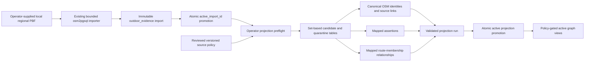

# TrailMind OSM Outdoor Research Projection V1

## Status and boundary

This package implements an offline, operator-invoked adapter from a promoted,
bounded `outdoor_evidence_*` OpenStreetMap import into the
`outdoor_research_*` Evidence Graph V2.

It is backend/data work only. It does not add an API route, background schedule,
runtime download, iOS behavior, release flag, route generation, ranking change,
derived feature, or new user-facing claim. Tracked
`OUTDOOR_EVIDENCE_ENABLED` state is unchanged.

The supported regions are the existing versioned operational regions:

- `harz-v1`
- `innsbruck-alps-v1`

The adapter reads only the region's atomically promoted import. It never queries
OpenStreetMap, Geofabrik, Overpass, Nominatim, or another public service at
runtime.

## Evidence and acquisition authority

The Evidence Graph source is exactly:

| Field | Value |
| --- | --- |
| Source key | `osm_foundational_data` |
| Source category | `openstreetmap_open_mapping` |
| Authority class | `open_community` |
| Evidence class | `mapped` |
| License | `ODbL-1.0` |
| Canonical origin | `https://www.openstreetmap.org` |
| Normalized facts | Allowed only after explicit reviewed policy activation |
| Derived features | Not allowed |

OpenStreetMap is the evidence authority. Geofabrik may appear only as
`acquisition_channel = geofabrik_regional_extract` and as an immutable extract
identifier/checksum receipt. Geofabrik is never stored or presented as the
authority for a mapped claim.

Every projected entity lineage record retains:

- OSM type, ID, version, and element timestamp;
- input import ID and region;
- extract/source identifier;
- source-data, retrieval, import, and projection timestamps;
- a recognized non-null acquisition channel;
- dataset name and immutable source identifier;
- a valid non-null local PBF SHA-256 computed by the importer;
- published checksum algorithm/value and successful verification timestamp for
  Geofabrik acquisitions;
- adapter version;
- ODbL license and OpenStreetMap attribution.

The canonical graph source stores:

> © OpenStreetMap contributors — https://www.openstreetmap.org/copyright

Downstream consumers remain responsible for displaying attribution wherever
OSM-derived data is presented.

## Architecture and data flow



Migration `004_osm_outdoor_research_projection.sql` adds:

- immutable acquisition/checksum receipt fields to evidence imports;
- versioned source policies and exact assertion/relationship scopes;
- projection runs and statuses;
- stable OSM identity mapping;
- append-only per-run entity, assertion, relationship, and quarantine lineage;
- per-run projected geometry so previous geometry remains auditable;
- policy-gated active views;
- relevant lookup, partial-unique, and GiST indexes;
- RLS on every new table.

The migration is additive. It does not create or activate the OSM source or
policy. Those mutations require the separate explicit operator command.

## Reviewed mapping

### Entity mapping

| Input record | Canonical category | Stable external identity | Geometry |
| --- | --- | --- | --- |
| POI `viewpoint` | `viewpoint` | OSM type + ID | Source geometry |
| POI `waterfall` | `waterfall` | OSM type + ID | Source geometry |
| POI `peak` | `peak` | OSM type + ID | Source geometry |
| POI `lake` | `lake` | OSM type + ID | Source geometry |
| POI `alpineHut` | `alpine_hut` | OSM type + ID | Source geometry |
| POI `wildernessHut` | `wilderness_hut` | OSM type + ID | Source geometry |
| Trail segment | `trail_segment` | OSM way ID | Source line geometry |
| Hiking relation | `hiking_route` | OSM relation ID | None invented |

Unsupported or ambiguous categories are quarantined. Missing/invalid OSM
version, timestamp, geometry, or identity also fails closed into quarantine.
The run fails if the complete input cohort cannot be accounted for as projected
or quarantined rows.

### Assertion mapping

The active reviewed policy contains only these exact
`(source, predicate, entity category)` scopes:

| Predicate | Entity category |
| --- | --- |
| `entity_category` | Each of the eight mapped categories above |
| `name` | Six POI categories and `hiking_route` |
| `operator` | `hiking_route` |
| `trail_difficulty` | `trail_segment` |
| `trail_visibility` | `trail_segment` |
| `viewpoint_presence` | `viewpoint` |
| `waterfall_presence` | `waterfall` |
| `access_restriction` | `trail_segment` |

Names and operators are emitted only when already bounded and structurally
valid. Unknown or overlong values are omitted; they are not silently truncated
into a stronger fact.

`sac_scale` and `trail_visibility` use only the bounded vocabularies already
enforced in `outdoor_evidence_trail_segments`.

Mapped access is deliberately asymmetric:

- `no` becomes `prohibited`;
- `permit` or an explicit permit tag becomes `permit_required`;
- private/customer/delivery/agricultural/forestry/use-sidepath values become
  `restricted`;
- a conditional tag or explicit seasonal marker becomes `conditional`;
- positive, permissive, missing, or unrecognized values produce no assertion.

The adapter never asserts `public_access = true`.

Mapped viewpoint/waterfall presence means only that the feature is mapped. It
does not establish scenic quality, current waterfall flow, drinking water, safe
access, or current availability.

### Relationship mapping

OSM hiking-relation membership is represented only as:

`trail_segment --trail_segment_member_of_route--> hiking_route`

A segment may belong to multiple route relations, and every membership remains
separate. Membership is never forced into a single-valued assertion and the
adapter does not emit `mapped_hiking_route_membership` assertions.

The mapped relationship does not make the route official, currently maintained,
open, safe, waymarked, or complete.

## Explicit source-policy gate

The adapter defaults to no authority:

- absence of the exact recognized policy fails closed;
- a proposed, retired, blocked, or mismatched policy fails closed;
- a paused/inactive source fails closed;
- missing or extra active assertion scopes fail closed;
- missing or extra active relationship scopes fail closed;
- normalized facts must be explicitly enabled;
- derived features must remain explicitly disabled.

Activation requires the version, a durable review reference, review timestamp,
and the exact confirmation phrase. The policy cannot silently broaden. A
changed scope requires a new reviewed policy version and code change.

Activation and revocation timestamps accept only calendar-valid UTC values in
one of these exact forms:

- `YYYY-MM-DDTHH:mm:ssZ`
- `YYYY-MM-DDTHH:mm:ss.SSSZ`

Offsets, partial dates, ambiguous dates, impossible calendar dates, and future
timestamps are rejected. The application uses an injectable clock for
deterministic tests, and the database independently rejects future policy
review/retirement timestamps.

Revocation atomically retires the policy and its assertion/relationship scopes.
Authority scopes are retired unless another exact, active, code-recognized
reviewed policy still requires them. When the last such policy is revoked, the
source is changed to `paused`, `normalized_facts_allowed` is set to `false`, and
derived features remain disabled. Active graph views then return no rows and
the graph write trigger rejects direct normalized assertions. Projection,
claim, relationship, identity, policy, and scope audit rows remain present.

A retired policy version is never reactivated. Deliberate recovery requires a
new code-recognized policy version, a new durable review record, the activation
confirmation, and recreation of the exact active scopes. Version
`osm-foundational-mapped-v2` is the explicit lifecycle-successor version for
that operation; it does not broaden the V1 mapping.

## Identity, change, absence, and audit behavior

Canonical entity identity is deterministic from:

`osm_foundational_data + OSM type + OSM ID`

The database separately records the source/type/ID-to-entity binding and rejects
collisions. Re-importing a newer version of the same OSM element preserves the
canonical entity ID.

For a still-present element:

- a new import appends a fresh immutable assertion receipt even when the mapped
  value is unchanged, so retrieval freshness is not inherited from an older
  import;
- changed content appends an assertion with `assertion_state = supersedes`;
- removal of a previously mapped, still-authorized tag appends an explicit
  `retracts` assertion;
- per-run geometry/version/provenance remains append-only in projection lineage.

For an element absent from a newer bounded extract, the newer active snapshot
does not include it. Absence does **not** create a deletion, closure, access,
safety, or current-status claim. Earlier runs and graph evidence remain
available for audit.

Relationships are immutable, import-receipt-specific, and snapshot-scoped. A
relationship absent from a newer active run is no longer active, but the older
relationship is retained.

## Freshness and import eligibility

The adapter enforces the strictest of:

- the region freshness threshold;
- the active source-policy maximum;
- the hard-coded reviewed policy maximum of 14 days.

It also requires:

`source_data_at <= retrieved_at <= imported_at <= projection time`

The selected import must:

- belong to the requested region;
- be the region's active import;
- have `status = active`;
- have a non-empty dataset name and source identifier;
- use one of `geofabrik_regional_extract`, `operator_supplied_local`, or
  `other_reviewed_bulk`;
- retain a lowercase 64-hex input-file SHA-256;
- retain non-null source-data, retrieval, and import timestamps;
- for `geofabrik_regional_extract`, retain a valid `md5` or `sha256` published
  checksum plus the importer timestamp proving successful verification;
- contain at least one structurally eligible trail segment;
- contain non-empty, internally countable source rows;

These fields are a promotion boundary, not a retrofit of the older
`outdoor_evidence_*` service. Legacy imports with nullable acquisition fields
may remain available to that older service, but the Evidence Graph adapter
rejects them.
- not move retrieval time backwards from the last active projection.

An operator may specify `--import-id`; doing so does not bypass the active-import
or region checks.

## Run lifecycle and rollback

Projection states are:

1. `loading`
2. `validating`
3. `active`
4. `superseded`
5. `failed`

The region import and projection both use PostgreSQL advisory locks. Candidate
construction, graph writes, validation, prior-run supersession, and new-run
activation happen in one transaction. Exactly one active run is allowed for a
source/region.

A dry run executes the same candidate construction and validation but rolls
back all writes and returns bounded aggregate counts.

On failure:

- transaction writes are rolled back;
- a persisted run receipt is marked `failed` with a bounded failure code when
  possible;
- the prior active projection remains the last-known-good snapshot;
- active graph views continue to expose that prior snapshot unless its source
  or policy is revoked;
- no coordinates, credentials, raw PBF content, or SQL details are logged.

Repeated projection of the same active
`region + import + policy + adapter version` returns `unchanged`.

## Operator commands

Run all commands from `backend`. Do not place credentials in shell history,
documentation, source identifiers, or review references.

### 1. Apply migrations

```sh
DATABASE_URL='<operator-provided PostgreSQL URL>' npm run db:migrate
```

### 2. Explicitly activate the reviewed policy

```sh
DATABASE_URL='<operator-provided PostgreSQL URL>' \
npm run outdoor-research:configure-osm-policy -- \
  --mode activate \
  --policy-version osm-foundational-mapped-v1 \
  --operator-confirmation activate-reviewed-osm-mapped-policy \
  --review-reference '<durable review record>' \
  --reviewed-at '<YYYY-MM-DDTHH:mm:ssZ or YYYY-MM-DDTHH:mm:ss.SSSZ>'
```

### 3. Import an already-downloaded bounded PBF

```sh
DATABASE_URL='<operator-provided PostgreSQL URL>' \
npm run outdoor-evidence:import -- \
  --region harz-v1 \
  --pbf '/absolute/path/to/bounded-harz.osm.pbf' \
  --dataset-name '<reviewed dataset name>' \
  --source-id '<immutable extract identifier without credentials>' \
  --retrieved-at '<ISO-8601 UTC timestamp>' \
  --source-timestamp '<extract ISO-8601 UTC timestamp>' \
  --acquisition-channel operator_supplied_local \
  --source-checksum 'sha256:<bounded derivative checksum>'
```

Use `innsbruck-alps-v1` for the Innsbruck pilot. The importer computes and
stores the local file SHA-256 automatically. A bounded PBF is a transformed
derivative, so it must be imported as `operator_supplied_local` and verified
against the derivative's own SHA-256. Before clipping, verify every exact
upstream Geofabrik artifact against its published checksum and retain that
separate acquisition receipt and transformation lineage in the reviewed
operator record. Use `geofabrik_regional_extract` only when the imported bytes
are the exact published artifact; that channel is rejected when its published
checksum is missing, malformed, or does not match the input.

For a reviewed local file that is not a Geofabrik extract, use:

```text
--acquisition-channel operator_supplied_local
```

The local channel still requires `--dataset-name`, `--source-id`,
`--source-timestamp`, and `--retrieved-at`; its input-file SHA-256 is still
computed and required. A published `--source-checksum` is optional for this
channel. If supplied, it is verified and its verification timestamp is stored.

The projection command never downloads a PBF.

### 4. Dry-run a projection

```sh
DATABASE_URL='<operator-provided PostgreSQL URL>' \
npm run outdoor-research:project-osm -- \
  --region harz-v1 \
  --import-id '<active import UUID>' \
  --policy-version osm-foundational-mapped-v1 \
  --operator-confirmation project-reviewed-osm-mapped-facts \
  --dry-run true
```

### 5. Promote a projection

Run the same command with:

```text
--dry-run false
```

Output is a single bounded JSON object containing schema/adapter version, status,
run ID, region/import/policy identifiers, aggregate counts, and duration. Failures
write one bounded JSON error object to stderr and exit nonzero.

### 6. Revoke the policy

```sh
DATABASE_URL='<operator-provided PostgreSQL URL>' \
npm run outdoor-research:configure-osm-policy -- \
  --mode revoke \
  --policy-version osm-foundational-mapped-v1 \
  --operator-confirmation revoke-osm-mapped-policy \
  --review-reference '<durable revocation record>' \
  --reviewed-at '<YYYY-MM-DDTHH:mm:ssZ or YYYY-MM-DDTHH:mm:ss.SSSZ>'
```

Revocation is not deletion. Final revocation also pauses the source and disables
normalized writes. Audit history remains intact. The same retired policy
version cannot be activated again; use only a separately reviewed,
code-recognized successor version.

## Bounded failure codes

Representative fail-closed codes include:

- `operator_confirmation_required`
- `missing_migrations`
- `unsupported_region`
- `unknown_region`
- `region_disabled`
- `active_import_unavailable`
- `wrong_region_import`
- `inactive_import`
- `source_timing_unavailable`
- `invalid_source_timing`
- `acquisition_channel_missing`
- `unrecognized_acquisition_channel`
- `input_file_sha256_missing`
- `input_file_sha256_invalid`
- `source_dataset_provenance_missing`
- `geofabrik_checksum_missing`
- `checksum_verification_missing`
- `checksum_verification_invalid`
- `stale_import`
- `empty_import`
- `source_policy_missing`
- `source_policy_inactive`
- `authority_scope_mismatch`
- `relationship_scope_mismatch`
- `derived_features_must_be_disabled`
- `concurrent_projection`
- `structurally_invalid_input`
- `deterministic_identity_collision`
- `projection_count_mismatch`
- `projection_invariant_failed`
- `projection_timed_out`

Unexpected database details are normalized to `projection_failed`.

## Prohibited claims

This adapter does not create:

- public-access permission;
- current opening or closure status;
- seasonal opening;
- overnight or camping permission;
- bookability;
- drinking-water availability;
- waterfall flow;
- route safety;
- legal access guarantees;
- trail-condition guarantees;
- scenic/beautiful/view-quality claims;
- official route status;
- derived scores or confidence percentages.

No missing row or missing tag is converted to a positive claim.

## Verification and real-data gate

Automated proof covers:

- mapping and bounded vocabularies;
- exact policy scopes and forbidden predicates;
- stable deterministic identities;
- bounded CLI failures;
- migration idempotency and RLS;
- real disposable PostGIS projection over synthetic OSM rows;
- POIs, trails, two routes, and one segment in multiple routes;
- provenance/attribution and Geofabrik's acquisition-only role;
- repeat-run `unchanged`;
- dry-run rollback;
- source-category, paused/blocked source, and permission drift rejection;
- missing/extra authority scope and relationship-scope rejection;
- wrong-region and empty-import rejection;
- changed-value supersession;
- stable identity across an OSM category change;
- removed-tag retraction;
- missing-element snapshot behavior;
- stale-input rejection with last-known-good preservation;
- policy revocation with audit retention;
- critical query-plan index eligibility.

During implementation there was no local bounded Harz or Innsbruck PBF and
available disk headroom was not safe for a new regional download. No data was
downloaded. Therefore this package has **synthetic real-PostGIS proof, not a new
real Harz/Innsbruck adapter projection receipt**.

The historical regional-import proof remains in
`docs/release/OUTDOOR_EVIDENCE_STAGING_PROOF.md`; it does not substitute for a
fresh projection run through this adapter. Before production enablement, an
operator must supply current bounded local PBFs or current promoted imports,
verify their checksums/timestamps, activate the reviewed policy, run dry-run and
real projection for both regions, inspect counts/quarantines/attribution, and
record the resulting run IDs.

This change does not enable a release or production reader.
