# Outdoor Research Executor and Dossier Assembler V1

## Purpose

The Outdoor Research Executor connects the deterministic research planner to the governed outdoor Evidence Graph. It produces an internal research dossier for later route-candidate generation. It does not generate a route, geometry, distance, duration, elevation profile, recommendation score, or safety conclusion.

The implementation is backend-only and is not connected to a public endpoint or release feature flag.

## Architecture

```mermaid
flowchart LR
  I["AdventureResearchIntentV1"] --> P["Preflight validation"]
  P --> B["Exact reviewed region binding"]
  B --> S["Read-only repeatable-read PostGIS snapshot"]
  S --> C["Database-derived capabilities"]
  C --> R["planOutdoorResearchV1"]
  R --> E["Typed bounded operation dispatch"]
  E --> T["EvidenceClaimV1 transformation"]
  T --> V["Existing deterministic resolver"]
  V --> A["Candidate and gap assembly"]
  A --> D["Validated immutable AdventureResearchDossierV1"]
```



The executor reuses the existing contracts, planner, OSM projection policy, active Evidence Graph views, validation, and evidence-resolution implementation. It does not create a parallel evidence schema.

## Orchestration API

The internal entry point is:

```js
researchOutdoorAdventureV1(intent, {
  repository,
  clock,
  signal,
  regionBindings,
  totalTimeoutMs
})
```

`repository` must expose `withConsistentSnapshot(context, work)`. Production-style PostGIS access uses:

```js
new PostgresOutdoorResearchRepository({
  pool,
  statementTimeoutMs
})
```

The dependency boundary is injected and bounded:

- `clock` is called once per execution and supplies `generatedAt`.
- `signal` is an optional `AbortSignal`.
- `regionBindings` defaults to the checked-in reviewed V1 binding set.
- `totalTimeoutMs` is bounded to 250–30,000 ms; the default is 7,500 ms.
- repository statement timeout is bounded to 100–15,000 ms; the default is 2,500 ms.

The result has one of three explicit states:

- `ready`: contains `normalizedIntent`, bounded `planningGaps`, and a validated, deeply frozen `dossier`;
- `clarification_required`: contains normalized intent and clarification questions, and performs no repository call;
- `unsupported`: contains normalized intent, planning gaps, and a bounded availability state, and never fabricates an empty successful dossier.

Unknown region bindings perform no database call. An anchor outside the exact bound polygon performs only the capability/containment query and no evidence query.

Invalid input and infrastructure failures use fixed `OutdoorResearchExecutorError` codes and fixed messages. They do not reflect prompts, coordinates, SQL, database details, URLs, credentials, or source records.

## Region binding

The versioned binding contract contains exactly:

- `schemaVersion`;
- stable research-region entity UUID;
- operational evidence-region ID;
- display name;
- supported activities.

The reviewed V1 bindings are:

| Research region UUID | Operational region | Display name |
| --- | --- | --- |
| `30000000-0000-4000-8000-000000000002` | `harz-v1` | Harz |
| `30000000-0000-4000-8000-000000000001` | `innsbruck-alps-v1` | Innsbruck Alpine Pilot |

Validation rejects unknown fields, duplicate UUIDs, duplicate operational IDs, malformed values, empty activity scope, and unsupported activities. Ordering and returned values are deeply immutable.

Resolution is exact. There is no nearest-region, centroid, or geographic fallback. The active snapshot must repeat the exact bound region UUID and operational ID. A mismatch fails with `inconsistent_snapshot`.

## Database-derived capabilities

The executor never accepts capabilities from the caller. `PostgresOutdoorResearchRepository.resolveCapabilities` derives them inside the same read-only snapshot used for evidence reads.

An executable capability requires all of the following:

- exact configured operational region;
- anchor covered by its PostGIS polygon;
- enabled region and exact active import;
- active projection run for that import;
- active OSM source with normalized facts allowed;
- active reviewed, recognized OSM policy;
- matching policy and adapter versions;
- exact active policy assertion scopes;
- exact active source authority scopes;
- exact active relationship scopes;
- valid import time ordering;
- source data inside the strictest configured freshness interval.

Paused, retired, revoked, incomplete, stale, scope-drifted, or mismatched state advertises no executable evidence capability.

The current OSM source advertises only:

- `discover_highlights`;
- `retrieve_mapped_hiking_routes`.

The supported mapped predicates are limited to the active reviewed policy:

- entity category;
- name and route operator;
- mapped access restriction context;
- mapped trail difficulty;
- mapped trail visibility;
- viewpoint presence;
- waterfall presence;
- mapped trail-segment membership in a hiking-route relation.

It does not advertise official, legal, current-condition, opening, overnight, drinking-water, bookability, closure, safety, scenic-quality, or current-flow capabilities.

## Read-only snapshot model

Every execution uses one transaction:

```sql
BEGIN TRANSACTION ISOLATION LEVEL REPEATABLE READ READ ONLY
```

The repository sets a transaction-local statement timeout. Capability resolution and every evidence operation run through the same client and snapshot, preventing one dossier from mixing active imports, projection runs, or policy states.

Queries use fixed checked-in SQL and typed parameters. Plan strings never become SQL. Evidence reads use strict active projection, assertion, relationship, source, policy, region, and import joins. Relationship reads additionally require the relationship source to equal the active projection-run source.

No query serializes unbounded geometry. Highlight queries return only bounded point-on-surface coordinates and verified distance from the anchor. Route queries return no route geometry.

## Geographic bounds

The search radius is deterministic:

```text
ceil(maximum requested distance in km × 500 meters)
```

This is half the maximum requested route distance, clamped to:

- minimum: 5 km;
- maximum: 50 km.

When no distance is supplied, the activity defaults are 20 km for hiking, 16 km for trail running, and 40 km for biking before applying the half-distance formula.

Every spatial query also clips to the exact operational-region polygon. It never expands into another region. Distance from an anchor is used only for geographic selection and ordering; it is never treated as route connectivity.

If the bounded radius extends beyond the distance to the region boundary, coverage is `partial` with `partial_regional_coverage`.

## Query and result bounds

V1 enforces:

- at most 32 highlight candidates per operation;
- at most 24 mapped routes per operation;
- at most one deterministic nearby membership sample per route;
- at most 160 repository rows per operation;
- at most 160 final evidence claims;
- at most 32 highlight candidates;
- at most 24 mapped route candidates;
- at most 24 overnight candidates;
- the existing 512 KiB dossier contract limit.

Repository results over an operation’s source, entity, predicate, region, or row scope fail closed. Duplicate IDs inside one repository result and conflicting payloads for one claim ID are rejected.

## Operation dispatch

Only validated `ResearchPlanV1` operations are dispatched, in planner order.

Current dispatch:

- `discover_highlights` calls the bounded mapped highlight query;
- `retrieve_mapped_hiking_routes` calls the bounded route-membership query and then the bounded assertion query for the selected entities.

Operation semantics remain distinct:

- rows transformed successfully: claims found;
- an empty bounded result: no relevant evidence;
- inactive or stale capability state: source unavailable or stale before dispatch;
- conflicting current claims: preserved as conflicted during resolution;
- a non-executable operation: omitted by capability-aware planning;
- cancellation: fixed `request_cancelled` or `execution_timed_out`;
- database failure/timeout: fixed infrastructure error, with no partial dossier.

Missing evidence is a dossier gap, not an infrastructure failure.

## Claim transformation

Stored assertions become `EvidenceClaimV1` values without inference or repair. The transformer preserves:

- assertion or relationship UUID;
- canonical entity UUID;
- typed predicate value;
- mapped evidence class;
- source UUID, key, and category;
- immutable provenance identifier;
- adapter version and OSM record version;
- observed, retrieved, validity, and freshness timestamps;
- resolution state;
- mapped-only limitations.

Every transformed claim passes `validateEvidenceClaimV1`.

A mapped route-membership relationship becomes a claim owned by the route entity with the segment entity as its `entity_reference` value. This lets a route candidate reference exact route-owned evidence while preserving the segment UUID.

The route-membership query selects the relationship's stored `evidence_class`.
Transformation requires that value to be exactly `mapped`; it is never
defaulted. Missing, official, community-observed, derived, model-inferred, or
unknown relationship provenance fails closed.

Repository timestamps are accepted only as valid `Date` values or
calendar-valid canonical UTC ISO strings (`YYYY-MM-DDTHH:mm:ss[.SSS]Z`).
Calendar rollover, year-only strings, local timestamps, offsets, invalid
strings, and invalid `Date` objects are rejected across assertions,
relationships, source summaries, snapshots, and freshness calculations.

Mapped access restrictions remain `unavailable` for legal access resolution and carry `access_unverified`. Absence of a restriction never becomes `public_access`.

The transformer never turns:

- mapped presence into current presence;
- a mapped hut into an open, bookable, watered, or overnight-permitted hut;
- an OSM route relation into an official route;
- a mapped viewpoint into scenic quality;
- missing closure data into an open trail;
- proximity into route connectivity.

## Resolution

Claims are grouped by exact entity and predicate and passed to the existing `resolveEvidenceClaimsV1` implementation with the injected execution time.

The assembler preserves `known`, `unknown`, `conflicted`, `stale`, and `unavailable`. It does not average values, choose a convenient value, or emit confidence percentages.

Conflict cohorts are copied into `conflictingEvidence` only when the existing resolver returns `conflicted`. Stale or unavailable category evidence cannot create a candidate.

## Candidate assembly

### Highlights

Highlight candidates require current, known category evidence for the same entity. Supported categories are viewpoints, waterfalls, peaks, lakes, alpine huts, wilderness huts, and landmarks.

Relevance reasons use only existing structured codes. Must-have and preferred experiences remain distinct. Ordering is deterministic:

1. must-have category tier;
2. preferred category tier;
3. verified anchor distance;
4. entity UUID.

If fewer candidates exist than `minimumCount`, the dossier contains an `insufficient_candidate_count` gap with the exact requested minimum and found count.

Every mapped highlight carries `route_connection_unverified`. V1 retrieves
route-to-segment membership, but it does not retrieve an explicit
POI-to-route relationship. Therefore included or requested highlight
candidates retain `missing_route_connection`, even when one or several mapped
route candidates are present. Segment membership and geographic proximity are
never reused as POI connectivity.

### Mapped routes

A route candidate requires:

- known mapped `hiking_route` category evidence;
- known mapped route-membership evidence;
- mapped source basis.

It carries `mapped_presence_only`, `official_status_unverified`, and `access_unverified`. It contains no geometry, distance, duration, elevation, safety, or official-route assertion.

Mapped route candidates count as zero toward an
`official_hiking_route` minimum. A must-have official-route request therefore
receives the exact `insufficient_candidate_count` shortfall plus
`missing_official_status`, regardless of how many mapped routes were found.
Preferred official routes retain `missing_official_status` without creating a
must-have count shortfall. Only compatible official authority/operator
membership evidence could contribute to an official-route count.

### Overnight locations

Mapped huts may be copied into `overnightCandidates` only as mapped locations. They retain explicit limitations for:

- access;
- opening;
- overnight legality;
- bookability;
- water availability;
- seasonal/current status.

No official campsite or legal bivouac is constructed from absent data.

## Dossier assembly

The assembler builds the existing `AdventureResearchDossierV1` with:

- exact normalized intent;
- exact region coverage;
- sorted evidence claims;
- deterministic highlight, route, and overnight candidates;
- time-sensitive checks;
- resolver-backed conflicts;
- typed evidence gaps;
- unresolved questions;
- complete source/license/attribution summaries;
- injected generation time;
- expiry based on active source freshness;
- aggregate freshness state.

Snapshot freshness and evidence freshness are separate. A valid current source
snapshot can produce zero evidence claims; in that case the dossier
`freshnessState` is `unknown`, while `expiresAt` still reflects the separately
validated snapshot freshness window. Empty evidence is never labeled
`current`.

The final value must pass `validateAdventureResearchDossierV1`; otherwise assembly fails closed. The returned result and every nested dossier value are deeply frozen.

Narrow V1 contract evolution was required to represent truthfully:

- `insufficient_candidate_count` with experience, required count, and found count;
- mapped access restriction context without treating it as verified legal access;
- `bookability_unverified`;
- `seasonal_status_unverified`.

The validators remain strict tagged unions and continue to reject broad high-stakes mapped claims.

## Determinism

The same validated intent, binding configuration, database snapshot, policy, and injected clock produce byte-for-byte equivalent output.

Deterministic rules include:

- planner operation order;
- fixed SQL shapes and `ORDER BY` clauses;
- stable claim sorting by entity, predicate, source, and claim UUID;
- stable candidate tier/distance/UUID ordering;
- canonical conflict and gap ordering;
- one injected execution timestamp;
- no random IDs generated by the executor.

## Cancellation and timeout behavior

An already-aborted request starts no database connection. The executor links an external signal to one internal total deadline and checks cancellation:

- before opening a snapshot;
- before capability resolution;
- between operations;
- inside every repository query;
- before commit and dossier assembly.

PostgreSQL cancellation uses the driver’s `AbortSignal`. SQLSTATE `57014` maps to `repository_timed_out`. External cancellation maps to `request_cancelled`; the total deadline maps to `execution_timed_out`.

No infrastructure or cancellation failure returns a partial dossier.

## Privacy and logging

V1 adds no analytics or tracking and emits no application logs. It does not retain or log:

- raw prompts;
- exact coordinates;
- source identifiers;
- SQL;
- geometry;
- database URLs;
- credentials;
- raw claims or dossiers.

The implementation does not inspect or modify secrets.

## Licensing and attribution

Every evidence claim references its governed source. Every dossier includes a complete `sourceProvenanceSummary` covering all claim sources and evidence classes.

The current source is OpenStreetMap foundational data under `ODbL-1.0`, with attribution required. The executor preserves source key, category, license identifier, attribution requirement, and retrieval time. It does not present Geofabrik or another extract distributor as the evidence authority.

## Validator-backed examples

The complete examples live in [outdoorResearchExecutorExamplesV1.js](../backend/test/fixtures/outdoorResearchExecutorExamplesV1.js) and are exercised by [outdoorResearchExecutorExamples.test.js](../backend/test/outdoorResearchExecutorExamples.test.js).

### Harz mapped-viewpoint dossier

```json
{
  "state": "ready",
  "regionCoverage": {
    "state": "full",
    "regionEntityIds": ["30000000-0000-4000-8000-000000000002"]
  },
  "candidateHighlights": ["mapped viewpoint"],
  "candidateLimitations": ["route_connection_unverified"],
  "evidenceGaps": [
    "missing_access_evidence",
    "missing_route_connection"
  ]
}
```

The full fixture passes `validateAdventureResearchDossierV1`.

### Innsbruck mapped-waterfall dossier

```json
{
  "state": "ready",
  "regionCoverage": {
    "state": "full",
    "regionEntityIds": ["30000000-0000-4000-8000-000000000001"]
  },
  "candidateHighlights": ["mapped waterfall"],
  "candidateLimitations": ["route_connection_unverified"],
  "evidenceGaps": ["missing_route_connection"],
  "forbiddenClaims": ["drinkable water", "current flow", "public access"]
}
```

The full fixture passes `validateAdventureResearchDossierV1`.

### Insufficient evidence

```json
{
  "state": "ready",
  "candidateHighlights": [],
  "freshnessState": "unknown",
  "evidenceGaps": [{
    "code": "insufficient_candidate_count",
    "experience": "viewpoint",
    "requiredMinimumCount": 2,
    "foundCount": 0
  }, {
    "code": "missing_route_connection",
    "predicate": null
  }]
}
```

This is a successful research execution with an explicit shortfall, not two fabricated candidates. The full fixture passes `validateAdventureResearchDossierV1`.

### Stale or revoked source

```json
{
  "state": "unsupported",
  "availabilityState": "source_stale",
  "dossier": "absent"
}
```

A revoked policy produces the same non-ready boundary with `source_unavailable`. The normalized intent remains contract-valid, but no empty successful dossier is created.

## Operational verification

The real PostGIS suite:

- provisions a disposable schema in an explicitly named test database;
- applies migrations 002, 003, and 004 twice;
- seeds bounded synthetic evidence for Harz and Innsbruck without network data;
- proves exact binding, polygon containment, and region isolation;
- proves active projection assertion and relationship reads;
- proves route membership, selected mapped evidence class, and provenance preservation;
- proves exact authority-scope enforcement;
- proves stale import handling;
- proves reviewed policy revocation removes active capabilities;
- proves deterministic repeated execution;
- proves real blocked-query statement timeout and cancellation;
- proves use of `outdoor_research_projection_entities_geometry_gist_idx`.

The integration suite contains 10 passing tests and is not skipped when `TRAILMIND_TEST_POSTGIS_DATABASE_URL` points to the disposable test database.

## Known limitations

- Only governed OSM mapped evidence is executable.
- No official authority/operator provider is configured.
- No current opening, closure, seasonal, overnight, booking, drinking-water, legal-access, weather, or current-condition provider exists.
- No terrain-analysis provider is executable.
- Biking network evidence is not modeled; biking can only use independently supported mapped highlight discovery.
- Route membership proves only an OSM relation-to-segment mapping.
- The dossier contains no route geometry and does not prove that a highlight is connected to a route.
- One nearby membership is retained per route in V1 to keep the dossier bounded.
- Source freshness is currently bounded by the strictest active setting, including the OSM expected refresh interval.
- The executor remains an internal boundary and is not release-enabled.

## Next integration step

The recommended next task is the Research-Guided Route Candidate Generator. It should consume this dossier, choose evidence-backed waypoint candidates, ask GraphHopper for real route geometry, verify actual route statistics, and rank real route candidates without upgrading mapped evidence into official, current, scenic, or safety claims.
