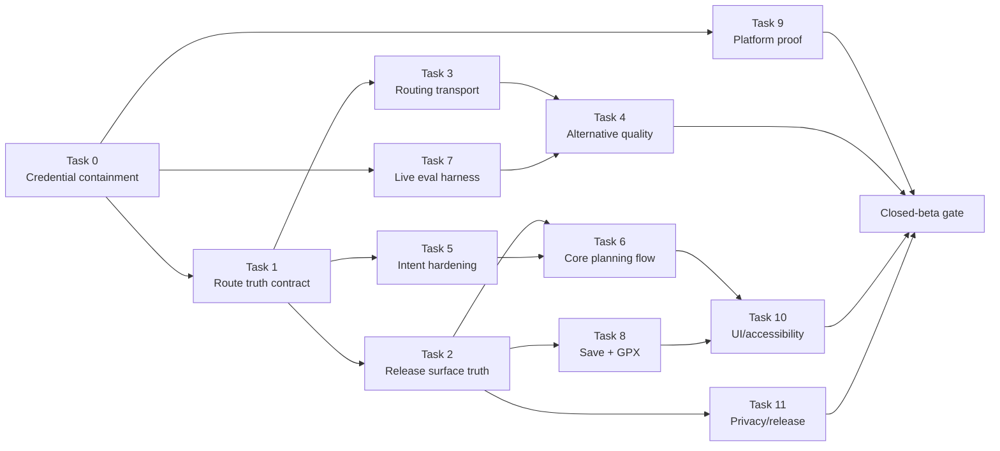

# Codex Agent Execution Plan

Audit snapshot: 2026-07-15. This is an implementation handoff, not authorization to start the backlog during the audit. Each task is intentionally bounded, has one file owner, and must preserve the route-truth and secret-handling rules in `AGENTS.md` plus the corrections in this audit.

## Program outcome and release boundary

The immediate outcome is a truthful closed-beta candidate for same-day hiking, trail-running, and biking:

> Describe a route, receive real GraphHopper-backed options, compare measured facts, inspect the geometry, save it locally, and export a valid GPX plan for review.

Active navigation, verified weather/water/closures/scenery, overnight planning, accounts, cloud sync, community, offline maps, and real conversational route editing are out of this tranche. Remove their production affordances rather than filling them with mocks.

## Non-negotiable execution rules

1. The credential incident is contained before any provider-backed test.
2. Agent 1’s route-truth contract is the first source-code task and merges before downstream route work.
3. A Release route success requires routed geometry, explicit provenance, and stats derived from the same provider response. No agent may add a fallback that substitutes `MockRoutes`.
4. Requested preferences remain requests unless separately verified. In particular, requested difficulty cannot become actual difficulty.
5. Never inspect, print, paste, log, or commit `Configuration/Local.xcconfig` or any provider credential. Secret scans must report only location/type/status, never values.
6. No new dependencies without a written need and owner approval. Prefer the current Foundation/SwiftUI/MapKit/XCTest stack.
7. Every agent starts from the verified baseline and runs its scoped tests. Integration owner reruns the full Swift and Node suites.
8. Agents do not edit files listed in “must not edit.” If a contract is missing, stop and request a small interface change from its owner.
9. User worktree changes remain user-owned. Do not reset, clean, or overwrite unrelated files or generated output.

## Shared bottleneck ownership

| Bottleneck | Exclusive owner / sequence | Rule |
|---|---|---|
| `TrailMind/Models/AdventureModels.swift` | Agent 1, then frozen interface; Agent 4 may receive a narrowly reviewed follow-up | Agents 2/3/5/6/7/8 consume the contract and do not edit it concurrently. |
| `TrailMind/Services/GraphHopperClient.swift` | Agent 1 provenance adaptation, then Agent 3 | Agent 4 must not edit it; route DTO/transport changes land before alternative-ranking changes. |
| `TrailMind/Services/RoutingFoundation.swift` | Agent 1 minimal provenance seam, then Agent 4 | Agent 3 must not edit it after handoff. |
| `TrailMind/ViewModels/AppModels.swift` | Agent 2 Release cleanup, then Agent 6 core-flow state machine | Agent 5 supplies parser contracts/tests without editing this file. |
| `TrailMind/Views/Home/HomeView.swift` | Agent 2, then Agent 6, then Agent 10 accessibility fixes | Never parallelize these edits. |
| `TrailMind/Views/Route/RouteDetailView.swift` | Agent 2, then Agent 8 GPX integration, then Agent 10 | Agent 7 must not add saved/history behavior here; use injected model APIs. |
| `TrailMind/Services/TrailServices.swift` | Agent 2 removes production mocks, then Agent 8 extracts/finishes GPX | Prefer creating a dedicated GPX file in Agent 8. |
| `TrailMind/Services/SavedRouteStore.swift` | Agent 1 schema/provenance migration, then Agent 8 | Agent 8 owns later history/delete-all work. |
| `TrailMind/Services/IntentParsingFoundation.swift` | Agent 5 | Agent 6 consumes an agreed clarification/provider contract. |
| `backend/src/parseIntent.js` | Agent 5 | Agent 9 does not edit it; platform findings are handed back to Agent 5. |
| `TrailMind.xcodeproj/project.pbxproj` | Agent 10 test target, then Agent 11 release resources if required | One owner at a time; use a project-file diff review. |

## Task 0 — Credential containment owner

- **Agent name:** `credential-containment`
- **Objective:** Revoke the credential exposed in the audit transcript and prove the replacement is not present in source/history/archive.
- **Why it matters:** Provider-backed testing and security assertions are invalid while a presumed-compromised credential remains active.
- **Exact scope:** Provider-console rotation, approved secret-store update, usage/quota review, non-printing repository/history/bundle checks, incident evidence.
- **May edit:** Security runbook or incident record that contains no secret; no code change is expected.
- **Must not edit:** `Configuration/Local.xcconfig` through an agent/tool that could print it; any source, plist, test fixture, or document with credential material.
- **Dependencies:** Human access to provider and approved secret stores.
- **Acceptance criteria:** Old credential rejected; replacement path verified through backend; usage review and quotas recorded; scans report no tracked/archive exposure without emitting values.
- **Required tests:** One authorized backend route smoke call after rotation; old-key negative check performed outside logs/chat.
- **Expected deliverables:** Incident closure note and safe scan summary.
- **Risks:** A broad search can create a second disclosure. Human must supervise every credential operation.
- **Merge order:** Gate 0; no merge necessarily, but provider tests wait for completion.

## Task 1 — Route truth and provenance foundation

- **Agent name:** `route-truth-contract`
- **Objective:** Make it impossible for a Release route with fabricated or mismatched facts to look like verified provider output.
- **Why it matters:** This is the largest technical and product-safety risk and the dependency for every later route-facing change.
- **Exact scope:** Typed non-optional route origin/verification; requested-versus-observed fact boundaries; backend provider decoding; Release success/save/export invariants; versioned persistence migration; constructor/test-fixture updates.
- **May edit:** `TrailMind/Models/AdventureModels.swift`, minimal provenance changes in `TrailMind/Services/GraphHopperClient.swift` and `RoutingFoundation.swift`, `TrailMind/Services/SavedRouteStore.swift`, related unit tests/fixtures.
- **Must not edit:** Home/Explore/Route views, `AppModels.swift`, backend behavior, AI-edit UI, GPX UI, unrelated presentation copy.
- **Dependencies:** Task 0 only for live smoke testing; source implementation starts immediately.
- **Acceptance criteria:** Every route has explicit provenance; backend provider identity is decoded; fallback-routed geometry is distinguishable without being called mock; demo/test routes fail the Release verified-success invariant; metric mutation without rerouting is impossible or rejected; save/export guards have typed errors; persistence migration/corruption behavior is tested.
- **Required tests:** GraphHopper decode, point-to-point, round-trip, fallback, route construction, save/reopen/migration/corrupt record, demo rejection, mismatched-metric regression; full `TrailMindTests` before merge.
- **Expected deliverables:** Domain contract, migration note, tests, short interface handoff for Agents 2–8.
- **Risks:** Wide constructor churn and persisted-data compatibility. Do not solve churn with optional provenance or a default that implies “verified.”
- **Merge order:** 1, first code merge.

## Task 2 — Release surface truth cleanup

- **Agent name:** `release-surface-truth`
- **Objective:** Ensure every production-visible route, claim, and primary action represents implemented behavior.
- **Why it matters:** Home, Explore, AI edit, fake recents, onboarding, Profile, and Start Route currently make the app look like a demo with unsafe success paths.
- **Exact scope:** Route supported examples into real planning; remove/Debug-isolate mock catalogue and developer demo; remove AI-edit and placeholder Start CTAs; remove fake recents; rewrite unsupported onboarding/Home/Profile copy; hide nonfunctional/offline controls; preserve Preview/test fixtures without Release reachability.
- **May edit:** `TrailMind/App/TrailMindApp.swift`, `TrailMind/Views/Home/HomeView.swift`, `TrailMind/ViewModels/AppModels.swift` only to remove the mock request branch, `TrailMind/Views/Onboarding/OnboardingView.swift`, `TrailMind/Views/Profile/ProfilePreferencesView.swift`, `TrailMind/Views/Route/RouteDetailView.swift`, `TrailMind/Views/AIEdit/RouteEditAIView.swift`, mock portions of `TrailMind/Services/TrailServices.swift`, `TrailMind/Data/MockRoutes.swift`, composition/planner tests.
- **Must not edit:** Route provenance types, GraphHopper request/response logic, `RoutingFoundation.swift`, saved-store schema, backend, GPX implementation beyond removing an unsafe entry point.
- **Dependencies:** Task 1.
- **Acceptance criteria:** Release has one real planning path; no Release CTA reaches `MockRoutes`, `MockAIPlannerService`, or the developer routing demo; failures remain failures; no fake recent/personalization; no dead Start/Edit action; visible examples and copy stay within same-day implemented capability.
- **Required tests:** Release-composition test, every CTA routing test, failure/no-route regression, app launch/onboarding smoke, full Swift suite.
- **Expected deliverables:** Clean Release surface, explicit list of Debug/Preview-only fixture paths, updated copy inventory.
- **Risks:** Accidentally deleting useful test fixtures or creating navigation gaps. Keep the UI small rather than replacing removed features with “coming soon.”
- **Merge order:** 2; after Task 1, before Tasks 6 and 8.

## Task 3 — GraphHopper transport and route reliability

- **Agent name:** `routing-transport-reliability`
- **Objective:** Harden provider requests, decoding, error classification, bounds, and fallback triggers without changing product UI.
- **Why it matters:** Real geometry is the product foundation; broad retries, unbounded successful payload size, or malformed data can create latency and integrity failures.
- **Exact scope:** Split or isolate backend versus direct-evaluation transport; narrow flexible-mode fallback to applicable errors; enforce response byte/coordinate/path-detail ceilings; validate metrics/geometry; preserve cancellation/deadlines; migrate deprecated geocoding in a separate commit if within scope and tested.
- **May edit:** `TrailMind/Services/GraphHopperClient.swift`, `BackendRouteGateway.swift`, `GeocodingService.swift` only for the warned MapKit migration, relevant GraphHopper/backend-client tests.
- **Must not edit:** `RoutingFoundation.swift`, route cards/views, `AppModels.swift`, mocks, persistence schema, backend GraphHopper provider unless a separately reviewed server contract defect is proven.
- **Dependencies:** Task 1; Task 7 supplies live runner evidence when available.
- **Acceptance criteria:** No overly broad flexible retry; invalid/oversized provider data fails with safe typed errors; coordinate order and 3D decoding remain correct; cancellation/timeouts remain bounded; point-to-point and loop requests retain exact GraphHopper rules; no secret is added to the app bundle.
- **Required tests:** Request-body fixtures, error mapping, timeout/cancel, malformed/oversized response, zero/one/many paths, elevation fallback, exact profile/round-trip/alternative parameters; full Swift suite.
- **Expected deliverables:** Smaller documented transport seams, reliability tests, warning status.
- **Risks:** Large 1,738-line file and direct-test compatibility. Mechanical extraction and behavior changes should be separate commits.
- **Merge order:** 3A; may run parallel with Tasks 5 and 9 after Task 1, but before Task 4.

## Task 4 — Alternative quality and factual ranking

- **Agent name:** `alternative-quality`
- **Objective:** Return 1–3 meaningfully distinct routes with labels/explanations derived only from measured geometry and stats.
- **Why it matters:** Comparison is the strongest differentiator, but real diversity is unproven and arbitrary match percentages/requested difficulty damage trust.
- **Exact scope:** Pairwise geometry similarity/overlap, backtracking/extreme-detour and closure checks, distance/duration envelopes, candidate deduplication, point-to-point alternative retention, deterministic factual labels/deltas, requested-versus-computed difficulty presentation contract.
- **May edit:** `TrailMind/Services/RoutingFoundation.swift`, dedicated new geometry/ranking files, `TrailMind/Views/Route/RouteComponents.swift` only after core semantics pass, routing/quality tests and fixtures.
- **Must not edit:** `GraphHopperClient.swift`, Home/App state, persistence, backend intent, mock services, route provenance definition.
- **Dependencies:** Tasks 1, 3, and 7 baseline; use Agent 1’s frozen contract.
- **Acceptance criteria:** Near-duplicates and invalid loops are rejected; badly missed target routes are rejected or explicitly labelled; one valid seed remains an honest single result; materially distinct alternatives survive; no arbitrary percentage/scenic/safety claim; requested-easy with hard returned stats shows factual outcome.
- **Required tests:** 1/2/3 candidate sets, one-seed success, several near-identical routes, distance misses, backtracking, detour, invalid geometry, duration ranking, cycling/trail-running profiles, deterministic label tests, live fixture evaluation.
- **Expected deliverables:** Geometry-quality module, factual ranking labels, evaluation delta report.
- **Risks:** Over-filtering and quota/latency growth. Never generate straight-line final geometry to fill a comparison slot.
- **Merge order:** 3B, after Task 3.

## Task 5 — Intent contract and backend AI hardening

- **Agent name:** `intent-reliability-security`
- **Objective:** Make local/remote parsing provenance accurate, bounded, privacy-ready, and evaluation-driven.
- **Why it matters:** Release is local-only while remote parsing exists in Debug; backend AI calls can hang and missing keys currently return mock “remoteAI” success.
- **Exact scope:** Provider timeout + caller cancellation; response-size bound; safe error envelopes; fail-closed production configuration; explicit local/test fixture flag; parser-source contract; schema/repair/validation compatibility; decide but do not independently enable remote Release behavior; expose a typed clarification result to Agent 6.
- **May edit:** `backend/src/parseIntent.js`, `backend/src/appAttest/intentSessionEndpoint.js`, backend intent tests, `TrailMind/Services/IntentParsingFoundation.swift`, `RoutePromptParser.swift`, intent tests/fixtures, `scripts/run-intent-eval.sh` in coordination with Agent 7.
- **Must not edit:** `AppModels.swift`, Home/Planning views, routing files, route models/provenance, saved routes, App Attest database modules except narrow lease-release tests through existing interfaces.
- **Dependencies:** Task 0 for live provider evaluation; Task 11 privacy decision before enabling remote AI in Release.
- **Acceptance criteria:** Missing production key fails closed; both providers abort on timeout/client disconnect; leases always release; raw provider content never reaches clients; source reports remote/local/test truthfully; 40-fixture deterministic suite stays green; malformed response and fallback policy are explicit.
- **Required tests:** Provider hang/disconnect/timeout/oversize/invalid JSON/config missing; repair/validation/schema enum drift; local evaluation; opt-in live evaluation after Task 7 fixes the runner.
- **Expected deliverables:** Stable intent contract, safe backend implementation, provider decision note for Release.
- **Risks:** Privacy/cost scope creep. Remote AI remains disabled until consent/deployment gates close.
- **Merge order:** 3A parallel lane; merge before Task 6.

## Task 6 — Core planning and clarification state machine

- **Agent name:** `core-planning-flow`
- **Objective:** Complete the real text/voice/example journey with in-context clarification and deterministic recovery.
- **Why it matters:** The service pipeline is capable, but ambiguity is presented as failure and manual UI proof is absent.
- **Exact scope:** One typed planning state machine; prompt preservation; clarification question/answer merge; cancel/retry/edit/no-route/error states; real examples; requested-but-unverified preference disclosure; route suggestion/detail navigation; accessibility identifiers for tests.
- **May edit:** `TrailMind/ViewModels/AppModels.swift`, `TrailMind/Views/Home/HomeView.swift`, `TrailMind/Views/Planning/PlanningViews.swift`, narrow navigation wiring and planner/view-model tests.
- **Must not edit:** Intent parser/provider internals, GraphHopper/ranking, provenance/persistence schema, backend, RouteDetail GPX, theme-wide redesign.
- **Dependencies:** Tasks 2 and 5; consume Task 4 labels if already merged, otherwise avoid conflicting route-card edits.
- **Acceptance criteria:** Describe → clarify → generate → compare → inspect works without restart; prompt survives errors; cancellation and retry cannot race into stale success; all entry points use the real coordinator; unsupported preferences remain explicitly unverified; dependency injection supports UI tests without mock outdoor claims.
- **Required tests:** View-model state transitions, stale-task cancellation, missing start/destination/region, malformed/unavailable intent, routing unavailable/no routes/slow path, one/multiple suggestions, all activities; handoff to Agent 10 UI suite.
- **Expected deliverables:** Documented state diagram, implementation, focused tests, accessibility-ID contract.
- **Risks:** MainActor/state races and large shared UI files. No broad redesign.
- **Merge order:** 4, after Tasks 2 and 5.

## Task 7 — Live evaluation infrastructure

- **Agent name:** `live-eval-harness`
- **Objective:** Ensure opt-in intent and route-quality commands execute rather than pass by skipping.
- **Why it matters:** The audited scripts both returned success while their sole test was skipped, leaving live quality unknown.
- **Exact scope:** Reliable XCTest environment/config injection, skip detection/nonzero status for required live runs, machine-readable summaries, redacted fixture output, documented provider/quota prerequisites.
- **May edit:** `scripts/run-intent-eval.sh`, `scripts/run-route-quality-eval.sh`, scheme/test-plan/evaluation configuration, `IntentEvaluationTests.swift`, `RouteQualityEvaluationTests.swift`, evaluation support only.
- **Must not edit:** Production app/service behavior, local secret configuration, route algorithms, backend provider code.
- **Dependencies:** Task 0; coordinate scheme/project ownership with Agent 10 before either edits project files.
- **Acceptance criteria:** A configured run proves the selected test executed and records counts; an unconfigured run fails or reports an explicit non-success skip; no credential or exact private user data is printed; local deterministic tests remain unaffected.
- **Required tests:** Configured/unconfigured runner checks, deliberate test failure propagation, skip detection, 40-intent and 20-route fixture baselines when authorized.
- **Expected deliverables:** Working scripts/config, baseline report, quota note.
- **Risks:** Live variability and provider cost. Keep live probes separate from deterministic merge gates.
- **Merge order:** 3A parallel lane; baseline required before Task 4 finishes.

## Task 8 — Persistence, real recents, and GPX handoff

- **Agent name:** `saved-and-export-loop`
- **Objective:** Make the return/share loop real: save, reopen, delete, optionally show real recents, and export a valid named GPX file.
- **Why it matters:** Saved storage is one of the stronger features, but fabricated routes can persist and GPX currently shares raw/possibly empty XML text.
- **Exact scope:** Provenance-aware saved migration; real recent metadata or no Home section; delete-all and corrupt-record recovery; XML escaping/elevation; protected temp `.gpx` file, typed share, error handling and cleanup. Split into two commits with file ownership below.
- **May edit:** Persistence commit: `SavedRouteStore.swift`, `SavedRoutesModel.swift`, `SavedRoutesView.swift`, tests. GPX commit after Task 2: new GPX service file or `TrailServices.swift`, `RouteDetailView.swift`, tests. Home integration is delivered as an API/spec to Agent 6 rather than editing `HomeView` concurrently.
- **Must not edit:** Route provenance definition, routing/intent/backend, mock planner, unrelated profile/settings, route-ranking UI.
- **Dependencies:** Tasks 1 and 2; Task 6 owns final Home recents integration.
- **Acceptance criteria:** Only verified routes persist/export in Release; save/reopen/delete/delete-all/migration/corrupt behavior passes; fresh install has no seed; GPX special characters/elevation/point counts validate; agreed route apps can import the file; export failure is visible; temp lifecycle is documented.
- **Required tests:** Persistence matrix, migration fixtures, atomic/recovery behavior, GPX XML parser validation, empty/invalid route rejection, filename sanitation, cleanup, manual share/import.
- **Expected deliverables:** Migration note, persistence APIs, GPX file exporter, interoperability evidence.
- **Risks:** Data loss and precise-location temp files. Do not silently discard old records without a recovery notice.
- **Merge order:** 5; persistence and GPX subcommits can be parallelized between two agents only because their files are disjoint, then integrated sequentially.

## Task 9 — Backend/App Attest staging proof

- **Agent name:** `backend-platform-proof`
- **Objective:** Convert strong unit-tested authorization code into repeatable deployed evidence.
- **Why it matters:** Simulator fakes cannot prove App Attest, PostgreSQL transaction behavior, edge identity, quotas, retention, or recovery.
- **Exact scope:** Disposable/staging PostgreSQL integration; migrations, TLS/access, replay/concurrency/budgets, pruning, backups/restore, trusted edge identity, safe logs, provider quotas/alerts; signed-device runbook and later TestFlight proof.
- **May edit:** `backend/src/appAttest/*` except intent provider implementation, `backend/migrations/*`, platform/integration tests, backend/deployment docs and narrowly scoped configuration examples without secrets.
- **Must not edit:** `backend/src/parseIntent.js`, iOS product UI/routing, local secret files, production deployment state without explicit authority.
- **Dependencies:** Infrastructure authority; signed device/TestFlight phases require Apple team access. Source/database tests can run earlier.
- **Acceptance criteria:** Disposable DB suite passes; deployed migrations/TLS/access/pruning/backups are evidenced; concurrent costs and replay fail closed; proxy identity is trusted by construction; logs are redacted; physical-device challenge/register/assert/session/expiry/replay succeeds; TestFlight production App Attest succeeds before beta distribution.
- **Required tests:** Backend full suite, real Postgres integration, concurrency/replay/expiry, outage/recovery, backup/restore/prune drill, device/TestFlight checklist.
- **Expected deliverables:** Staging evidence pack, operational runbooks, remaining paid-membership checklist.
- **Risks:** External state/cost and environment drift. Never weaken production checks to make Simulator tests pass.
- **Merge order:** 3A platform lane through 6; final device evidence gates beta.

## Task 10 — UI automation, accessibility, and performance

- **Agent name:** `ios-quality-accessibility`
- **Objective:** Turn the currently manual/partial runtime evidence into a repeatable critical-path and accessibility gate.
- **Why it matters:** No UI-test target exists and deeper Simulator interaction could not be verified in the audit.
- **Exact scope:** Add UI-test target and deterministic test launch composition; onboarding/core flow/save/export smoke tests; VoiceOver labels/values; Dynamic Type, Reduce Motion, contrast/button shapes, appearance/layout passes; long-geometry map/thumbnail performance measurement.
- **May edit:** new UI-test files/target, `TrailMind.xcodeproj/project.pbxproj`, scheme/test plan, accessibility modifiers/identifiers in stable views after their owners merge, test-only launch configuration.
- **Must not edit:** Routing/intent/persistence business logic, backend, mock success, broad visual redesign, minimum OS without Task 11 decision.
- **Dependencies:** Test-target scaffolding may begin after coordinating with Task 7; view automation/fixes follow Tasks 2, 6, and 8.
- **Acceptance criteria:** UI suite covers launch/onboarding, point-to-point, multi-loop comparison, clarification, error/retry, detail, save/reopen/delete, and GPX handoff; no test relies on external providers; accessibility matrix passes on supported devices; performance budgets and failures are documented.
- **Required tests:** New UI suite plus full Swift tests/build; manual VoiceOver/largest text/reduced motion/contrast; memory/scroll/map/thumbnail measurements.
- **Expected deliverables:** UI target, stable launch/test seam, accessibility report, performance baseline.
- **Risks:** Brittle selectors and project-file conflicts. Accessibility identifiers must describe meaning, not implementation.
- **Merge order:** 6, after user-flow feature merges; test scaffolding can land earlier as an isolated commit.

## Task 11 — Privacy, release configuration, and Apple-readiness package

- **Agent name:** `privacy-release-readiness`
- **Objective:** Prepare every release/compliance artifact possible before paid membership and clearly isolate the later Apple-team steps.
- **Why it matters:** Public readiness is approximately 18%; privacy/attribution/signing evidence is a larger gate than App Store cosmetics.
- **Exact scope:** Observed data-flow inventory; remote-AI consent decision; in-app privacy/about/attribution; local delete-all requirement handoff; Xcode privacy report and evidence-based manifest; permission strings; bundle/version/config review; archive secret/debug-fixture checklist; policy/App Privacy/review-note/metadata/screenshot-plan drafts; supported OS/device/locale/appearance decision.
- **May edit:** privacy/about resources/views after Task 2, `Configuration/TrailMind-Info.plist`, `PrivacyInfo.xcprivacy` if justified, release documentation, project settings only after Agent 10 releases `project.pbxproj` ownership.
- **Must not edit:** Credentials, production provider settings, routing/intent behavior, fake features to match marketing, App Store Connect or deployments without explicit authority.
- **Dependencies:** Final v1 boundary and Task 2 UI cleanup; actual App Store entry/signing/TestFlight needs paid team access.
- **Acceptance criteria:** Policy/consent/labels/manifest match observed traffic/files/logs; OSM/GraphHopper/MapKit/Apple Speech/AI disclosures are accurate; Release configuration has no developer/mock resource; archive inspection checklist is executable; work-now versus paid-later list is explicit.
- **Required tests:** Clean Debug/Release build, privacy report/resource validation, permission-denial checks, safe archive/string/resource/entitlement scan, metadata-to-feature traceability review.
- **Expected deliverables:** In-app privacy/attribution surface, privacy and release package, Apple-team dependency checklist.
- **Risks:** Guessing manifest declarations or writing policy ahead of implementation. Revalidate on the exact archive.
- **Merge order:** Policy drafting parallel from 3A; app/resource integration at 6–7; final Apple steps after membership.

### Task 11 membership split

**Can be completed now without paid Apple membership:** data-flow observation, source/configuration fixes, privacy and attribution UI, policy/App Privacy/review-note drafts, privacy-report/manifest analysis, permission copy, Simulator Release builds, UI tests, archive-check tooling, version/bundle review, accessibility/localization work, and a complete metadata/screenshot plan based on the real app.

**Must wait for paid team access:** registering the production App ID/capabilities, intended-team certificates/profiles, distribution signing, App Store Connect record and roles, TestFlight upload/invitations/review, production-environment App Attest proof, entering final App Privacy/store metadata, and App Review submission/release. Personal Team or Simulator evidence must not be relabelled as proof of these steps.

## Deferred specification — Basic route following

- **Agent name:** `route-following-spec` (do not implement in this tranche)
- **Objective:** Decide after beta whether TrailMind remains a planner/exporter or adds foreground basic following.
- **Why it matters:** The current Start Route control is a placeholder, but full navigation would add location, battery, background, safety, privacy, and signing scope.
- **Exact scope:** Product/technical specification only: current location, route progress, remaining distance, next decoded instruction, basic off-route state, completion, denied/restricted permission, foreground/background boundary, and non-goals.
- **May edit:** A future design document only.
- **Must not edit:** Product source, entitlements, location purpose strings, or UI until separately authorized.
- **Dependencies:** Closed-beta evidence and completed GPX planner loop.
- **Acceptance criteria:** Go/no-go decision, measurable user need, safety/privacy boundary, state model, energy budget, test plan, and explicit exclusion of offline turn-by-turn navigation.
- **Required tests:** None until implementation is approved; specification must define them.
- **Expected deliverables:** Decision brief.
- **Risks:** Premature scope expansion.
- **Merge order:** Post-beta only.

## Parallel execution waves

### Wave 0 — contain

- Task 0 only for external provider access. Source-only planning can be prepared, but no live provider test runs.

### Wave 1 — establish the contract

- Task 1 is the only core-source task. Freeze and document the interfaces before parallel agents begin.

### Wave 2 — safe parallel lanes

- Task 2 owns product surfaces.
- Task 3 owns GraphHopper transport.
- Task 5 owns intent/backend provider behavior.
- Task 7 owns evaluation configuration.
- Task 9 owns App Attest/PostgreSQL platform proof.
- Task 11 may draft policy/data maps only.

These lanes are parallel only under the bottleneck table above.

### Wave 3 — product-quality implementation

- Task 4 follows Task 3 and the live baseline.
- Task 6 follows Tasks 2 and 5.
- Task 8 follows Tasks 1 and 2; its persistence and GPX commits can be split across disjoint files.

### Wave 4 — integration gate

- Task 10 adds/finishes UI, accessibility, and performance verification after stable UI merges.
- Task 11 integrates privacy/release resources and validates the exact Release product.
- Task 9 supplies deployed/signed evidence when infrastructure and Apple access exist.

## Integration-owner checklist

The integration owner, not an individual feature agent, declares the tranche complete only when:

1. All source changes are rebased/merged in the order above with no shared-file overlap hidden in conflict resolutions.
2. `xcodebuild build` succeeds for Debug and Release Simulator.
3. The full `TrailMindTests` suite passes with opt-in live skips reported separately, never counted as provider proof.
4. `npm test` and `npm audit --omit=dev` pass; real PostgreSQL integration status is explicit.
5. The UI smoke suite passes without network dependencies.
6. Authorized live intent/route-quality fixtures actually execute and publish redacted counts.
7. No Release path references mock route success, fake history, geometry-free editing, dead navigation, arbitrary match percentages, or unsupported outdoor claims.
8. Save/export accept only verified routes; migration and GPX interoperability evidence exists.
9. A non-printing secret scan and exact Release archive inspection pass.
10. Remaining paid-membership items—production signing, App ID/capabilities, TestFlight, production App Attest, App Store Connect, and submission—are still listed as external gates until proven.
