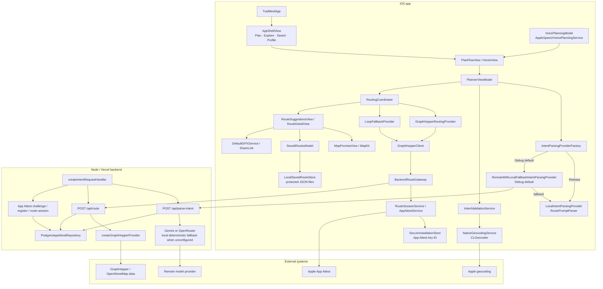

# Architecture Map

Audit snapshot: 2026-07-15. This map describes the repository as implemented, including Debug/Release differences and local/demo branches that are easy to miss from the directory structure.

## Repository and target shape

| Area | Current shape | Evidence |
|---|---|---|
| iOS application | One SwiftUI application target, `TrailMind` | `TrailMind.xcodeproj/project.pbxproj`; `TrailMind/App/TrailMindApp.swift` |
| iOS tests | One unit-test target, `TrailMindTests`; no UI-test target | `TrailMind.xcodeproj/project.pbxproj`; `TrailMindTests/` |
| Swift packages | No remote Swift Package dependencies | Empty `packageProductDependencies` in `TrailMind.xcodeproj/project.pbxproj` |
| Backend | Node 20+ ES modules, with Vercel entry point and a local Node server | `backend/package.json`, `backend/api/index.js`, `backend/src/server.js` |
| Backend persistence | PostgreSQL for App Attest/security/session/rate state only | `backend/src/appAttest/postgresAppAttestRepository.js` and `backend/migrations/001_app_attest.sql` |
| Evaluation tooling | Intent and route-quality fixture runners | `scripts/run-intent-eval.sh`, `scripts/run-route-quality-eval.sh`, `TrailMindTests/Fixtures/` |
| Build baseline | iOS 26, Swift 6, complete strict concurrency; app defaults to `MainActor` isolation | `TrailMind.xcodeproj/project.pbxproj` |

The Swift directory names suggest layers, but they are not separate modules. `App`, `Models`, `Services`, `ViewModels`, `Views`, `Theme`, and `Data` all compile into the same app target, so dependency direction is conventional rather than compiler-enforced.

## Runtime architecture

## Layer and ownership map

| Directory / subsystem | Responsibility actually owned | Important symbols |
|---|---|---|
| `TrailMind/App` | App lifecycle, onboarding switch, environment injection, tab shell, Explore demo | `TrailMindApp`, `AppShellView`, `ExploreView` |
| `TrailMind/Views` | Home/composer, planning progress, suggestions, detail, map, save/profile UI, AI-edit UI | `PlanFlowView`, `HomeView`, `RouteSuggestionsView`, `RouteCard`, `RouteThumbnailView`, `RouteDetailView`, `MapPreviewView`, `RouteEditAIView` |
| `TrailMind/ViewModels` | Shared app state, planning orchestration/state machine, saved-route presentation state, voice state, mock route editing | `AppModel`, `PlannerViewModel`, `SavedRoutesModel`, `VoicePlanningModel`, `RouteEditViewModel` |
| `TrailMind/Models` | Domain values plus substantial route-quality and presentation semantics | `AdventureIntent`, `RoutePlanningRequest`, `RoutePlanningMetadata`, `TrailRoute`, `RouteSuggestion`, `VerifiedRouteCharacteristics`, `UserPreferences` |
| `TrailMind/Services` | Parsing, validation, geocoding, route orchestration, GraphHopper transport/decoding, backend auth, persistence, thumbnails, voice, map and GPX helpers | `IntentParsingProvider`, `NativeGeocodingService`, `RoutingCoordinator`, `GraphHopperClient`, `BackendRouteGateway`, `RouteSessionService`, `AppAttestService`, `LocalSavedRouteStore`, `RouteThumbnailService` |
| `TrailMind/Data` | Editorial/demo fixtures compiled into the app | `MockRoutes` |
| `TrailMind/Theme` | Colors, spacing, typography, card/glass modifiers | `TrailTheme` and related style helpers |
| `backend/src` | HTTP composition, AI intent provider selection/sanitization, route request validation/proxying, App Attest verification, authorization and rate accounting | `createIntentRequestHandler`, `parseIntentEndpoint`, `createRouteEndpoint`, `createGraphHopperProvider`, `createAppAttestRuntime` |
| `backend/migrations` | Durable schema for challenges, registered keys, route sessions, replay IDs, windows and provider leases | `001_app_attest.sql` |
| `TrailMindTests` / `backend/test` | Swift unit/evaluation tests and Node unit/integration tests | 179 Swift `test…` methods; 115 Node `it(…)` cases at audit time |

## Application composition

`TrailMindApp` owns:

- `@AppStorage("hasCompletedTrailMindOnboarding")`;
- a `TrailTheme` environment value;
- a shared `AppModel` environment value;
- initial saved-route loading;
- a forced light color scheme.

After onboarding, `AppShellView` presents four tabs:

- Plan → `PlanFlowView`;
- Explore → `ExploreView`;
- Saved → `SavedRoutesView`;
- Profile → `ProfilePreferencesView`.

`PlanFlowView` owns a `PlannerViewModel` and a `NavigationStack` path of `TrailRoute` values. The view model switches among `home`, `generating`, and `suggestions`. A single generated route is pushed directly to detail; multiple routes remain in the comparison surface.

The app composition is small, but the feature boundaries are porous: `ExploreView` directly constructs `GraphHopperClient`, route detail directly constructs `DefaultMapService` and `DefaultGPXService`, and profile settings are not injected into planning.

## Natural-language and intent flow

### Dynamic route path

1. `PromptComposerView` submits text; `VoicePlanningModel` can populate the same prompt using `AppleSpeechVoicePlanningService`.
2. `PlanFlowView` calls `PlannerViewModel.startTextRoute(prompt:)`.
3. `PlannerViewModel.generateDynamicRoute` asks the configured `IntentParsingProvider` for `AdventureIntent`.
4. `IntentValidationService` validates, repairs, or requests clarification.
5. The view model converts the validated intent to `RoutePlanningRequest` / `RouteIntent`.
6. `NativeGeocodingService` geocodes start and end queries, with a Germany bias, an optional start-context bias for the destination, and an in-memory cache.
7. `RoutingCoordinator` creates routed suggestions.

### Provider rollout

`IntentParsingProviderFactory.makeDefaultProvider` is build-conditional:

- Debug default: `RemoteWithLocalFallbackIntentParsingProvider`.
- Debug override: local-only through `TRAILMIND_INTENT_PARSER_MODE`.
- Release: `LocalIntentParsingProvider`.

`RemoteAIIntentParsingProvider` sends prompt, locale, and optional location hint to `POST /api/parse-intent` with route-session authorization. The backend selects Gemini or OpenRouter when configured; if neither provider key exists in local/test operation, `parseIntentEndpoint` returns a deterministic sanitized mock intent.

That deterministic backend fallback also reports `parserSource: "remoteAI"`, so the current client contract cannot distinguish it from an actual model-provider result.

The backend is prohibited from returning route geometry. `AdventureIntent` remains the boundary between interpretation and routing.

### Parallel mock path

`PlannerViewModel.startPlanning(prompt:)` selects `RequestKind.mockSuggestions` and delegates to `MockAIPlannerService`. Home example chips use this path. This is not a fallback from the real route pipeline; it is a separate product path that happens to share the same loading and suggestion presentation.

## Routing flow

### Primary provider

`RoutingCoordinator` defaults to:

- `GraphHopperRoutingProvider` as primary;
- `LoopFallbackProvider` as loop supplement/fallback;
- `LoopSearchPolicy.comparisonDefault` as the comparison budget.

`GraphHopperRoutingProvider` maps:

- hiking and trail running to GraphHopper `foot`;
- biking to `bike`;
- point-to-point requests to a normal or bounded `alternative_route` request;
- loop requests to GraphHopper `round_trip` variants using seeds 11, 29, and 47.

The default `GraphHopperClient()` uses `BackendRouteGateway`. Explicit `configurationProvider` initialization selects the older direct GraphHopper transport used by tests/evaluations.

### Loop supplement and fallback

For loop planning, `RoutingCoordinator`:

1. normalizes direct round-trip variants with `RouteSuggestionNormalizer.comparableLoopSuggestions`;
2. accepts the direct result when it contains the configured minimum number of distinct options;
3. otherwise asks `LoopFallbackProvider` for closed multi-point candidates;
4. combines direct and fallback results;
5. rejects poor distance fit, invalid closure/shape, high overlap, or duplicates;
6. ranks and labels the remaining variants;
7. returns diagnostics and a user notice where appropriate.

`LoopFallbackProvider` builds bearing-pattern candidates around the same start and routes their segments through GraphHopper. It does not draw straight-line geometry as the final route.

### Backend route boundary

`BackendRouteGateway` creates a narrow `BackendRouteRequest` and adds a weighted route-session authorization plus a unique request ID. `backend/src/routing/routeValidation.js` rejects unknown or unsupported fields, provider URLs, keys, arbitrary custom models, invalid coordinate shapes, excessive points/distances, and unsupported path details.

`backend/src/routing/graphHopperProvider.js` is the production owner of:

- provider URL/key use;
- GraphHopper longitude/latitude conversion;
- `round_trip` and `alternative_route` parameters;
- the server-approved custom model;
- upstream error classification;
- response sanitization.

`GraphHopperClient.makeTrailRoute` decodes sanitized paths into `TrailRoute`, including path coordinates, distance, duration, ascent/descent, instructions, supported path details, requested planning metadata, fixed technical highlights, and safety notes.

## Backend security and state

Both remote intent and route requests consume an opaque route session. The iOS flow is:

`BackendRouteGateway` / `RemoteAIIntentParsingProvider` → `RouteSessionAuthorizing` → `RouteSessionService` → `AppAttestService` → challenge/register/route-session endpoints.

Important ownership:

- `SecureInstallationStore` keeps the App Attest key ID in Keychain.
- `RouteSessionService` caches only the short-lived token and remaining weighted cost in memory.
- `AppAttestService` uses `DCAppAttestService` for key creation, attestation, and assertions.
- Debug Simulator traffic to an HTTP loopback backend can use `LoopbackDevelopmentSessionAuthorizer`; Release and device builds cannot.
- `PostgresAppAttestRepository` stores challenges, registered-key verification state, sessions, request IDs, rate windows, and concurrency leases.
- The backend does not persist prompts, coordinates, route bodies, route history, user accounts, or saved routes.

`backend/docs/app-attest-device-verification.md` explicitly records that simulator fakes do not prove real App Attest behavior and that physical-device, TestFlight, and App Store validation remain required operational checks.

## Presentation flow

`RouteSuggestionsView` renders `RouteSuggestion` values using `RouteCard`. Cards combine:

- normalized `RouteThumbnailView` geometry;
- title and variant label;
- distance, duration, elevation, activity, and route type;
- quality explanations and optional Debug diagnostics.

`RouteDetailView` renders:

- `MapPreviewView` with MapKit polyline and markers;
- primary route stats;
- planning metadata and requested features;
- `VerifiedRouteCharacteristicsView` when path details exist;
- elevation, waypoints, generated highlights, and safety notes; GraphHopper instructions are decoded and persisted but are not rendered by a View;
- local save, raw GPX-XML text sharing, mock AI edit, and placeholder start actions.

No interactive map is embedded in suggestion lists. `RouteThumbnailService` caches normalized geometry in memory, and `RouteThumbnailView` renders it with SwiftUI `Path` / `GeometryReader`. It does not use a map snapshotter or make thumbnail-specific network calls.

## Persistence and data ownership

| Data | Owner | Lifetime / storage |
|---|---|---|
| Onboarding completion | `TrailMindApp` | `@AppStorage` / UserDefaults |
| Planning state and suggestions | `PlannerViewModel` | In memory for the current `PlanFlowView` |
| User preferences | `AppModel.preferences` | In memory only; recreated on launch and not consumed by planning |
| Saved routes | `SavedRoutesModel` + `LocalSavedRouteStore` | One versioned, atomically written, file-protected JSON file per route under Application Support |
| App Attest key ID | `SecureInstallationStore` | Keychain |
| Route-session token/budget | `RouteSessionService` | In memory, short-lived |
| Backend App Attest/session/rate state | `PostgresAppAttestRepository` | PostgreSQL |
| Backend route geometry/history | None | Not persisted |
| Voice transcript | `VoicePlanningModel` | In memory |
| Geocoding cache/context | `NativeGeocodingService` | In memory per service instance |

`SavedRouteStore.swift` manually maps nearly the complete `TrailRoute` aggregate into `Persisted*` DTOs. `IntentDebugMetadata` is intentionally not persisted. The store skips unsupported/corrupt records and reports a recovery notice rather than failing the entire load.

## Shared domain contracts

The central contract is `TrailRoute` in `TrailMind/Models/AdventureModels.swift`. It aggregates:

- identity and editorial display fields;
- activity, route type, difficulty, distance, duration, ascent/descent;
- summary and match explanations;
- highlights, waypoints, multi-day sections, and safety notes;
- elevation samples, geometry, and instructions;
- planning metadata, verified characteristics, and optional debug metadata.

Upstream planning contracts:

- `AdventureIntent`: parser output; no geometry;
- `IntentValidationResult`: valid/repaired/clarification/invalid state;
- `RoutePlanningRequest`: typed request for route shaping;
- `RouteIntent`: request plus geocoded coordinates;
- `RoutingResult` / `RouteSuggestion`: presentation-ready alternatives;
- `RoutePlanningMetadata`: requested targets, variant labels, and shaping summary.

`TrailRoute` is convenient for view navigation and persistence, but its size causes services, mocks, persistence, presentation copy, and trust semantics to change together.

## Frameworks and external dependencies

### iOS

No third-party Swift packages are declared. The app uses:

- SwiftUI and Observation for UI/state;
- MapKit for map display/polyline construction;
- Core Location for geocoding and an unused current-location service;
- Speech and AVFAudio for voice prompts;
- DeviceCheck/App Attest for installation verification;
- Security/Keychain for the App Attest key ID;
- CryptoKit/Foundation networking for authorization and API transport.

### Backend

`backend/package.json` declares exact versions of:

- `asn1js` and `pkijs` for certificate/attestation verification;
- `cbor-x` for App Attest payload decoding;
- `pg` for PostgreSQL.

External runtime services are GraphHopper/OSM routing data, Apple App Attest, Apple geocoding, an optional Gemini or OpenRouter model endpoint, and PostgreSQL. A Vercel/Supabase integration may supply `POSTGRES_URL`, but Supabase is not used for product accounts or route data.

## Build and configuration boundaries

- `TrailMind` and `TrailMindTests` are the only Xcode targets.
- Debug uses the development App Attest entitlement; Release uses the production entitlement.
- `INTENT_BACKEND_BASE_URL` is injected through Info.plist/build settings. Release maps it to a production backend setting, even though the Release intent-provider factory currently selects local parsing.
- The default route transport uses the backend in all builds.
- `Configuration/Local.xcconfig` is optional, ignored, and outside this audit. The direct GraphHopper configuration path should be treated as test/evaluation compatibility, not as the public architecture.
- Swift 6 complete strict-concurrency checking is enabled. The app target is MainActor-isolated by default; the test target is nonisolated by default.

## Coupling and ownership risks

### P0 — Mock route editing can corrupt the meaning of a real route

`MockAIPlannerService.editRoute` changes metrics and descriptions while retaining the old geometry. `RouteEditAIView` is reachable from every route detail. This crosses routing, trust, and presentation boundaries and can turn provider-backed facts into fabricated values.

Recommended seam: route-edit intent → validated `RoutePlanningRequest` change → new geocoding/routing operation → new `TrailRoute` with explicit provenance. No display metric should be mutated independently of geometry.

### P1 — Two planning systems share one Home experience

`PlannerViewModel` owns both a mock planner service and the real parser/geocoder/router stack. `RequestKind` decides which system runs, and Home sends different controls to different request kinds. This makes behavior depend on UI entry point rather than user intent.

Recommended seam: a single production `PlanningUseCase` returning typed progress and `RoutingResult`; compile or inject demo fixtures only for previews/tests.

### P1 — `GraphHopperClient.swift` is a transport/domain monolith

At 1,738 lines, the file owns:

- four compatibility protocols;
- backend and direct transports;
- request construction for normal, alternative, round-trip, and multi-point routes;
- retry/flexible-mode fallback;
- response DTOs and decoding;
- domain construction and presentation copy;
- route ranking/labels and demo helpers.

The default backend architecture has already made the direct path secondary, but both implementations remain interleaved. Stale TODOs still say a backend proxy must be added.

Recommended seams: backend request adapter, direct-evaluation adapter, GraphHopper DTO decoder, `TrailRoute` assembler, and provider-error mapper.

### P1 — `RoutingFoundation.swift` centralizes too many algorithms

At 1,327 lines, it combines orchestration, time/concurrency policy, fallback candidate generation, geographic math, geometry signatures, closure/shape/overlap quality, deduplication, ranking, labels, shaping summaries, notices, and diagnostics.

Recommended seams: `LoopCandidateGenerator`, `RouteGeometryAnalyzer`, `RouteSuggestionFilter`, `RouteSuggestionRanker`, and the higher-level coordinator.

### P1 — `AdventureModels.swift` mixes domain, algorithms, and UI language

At 1,494 lines, it contains core models, request defaults, route-shaping semantics, verified path aggregation, quality-explanation generation, debug formatting, display labels, and user preferences. Models therefore know about card copy and ranking explanations, while services create UI-rich aggregates.

Recommended seams: domain values, routing request/metadata, provider-derived characteristics, quality analysis, and presentation formatting.

### P1 — `IntentParsingFoundation.swift` is a second orchestration monolith

At 1,101 lines, it combines provider protocols, backend HTTP/session authorization, Debug diagnostics, local fallback policy, backend DTO mapping, validation, repair, and heuristic interpretation. `RoutePromptParser.swift` adds another 392 lines of language rules.

Recommended seams: provider transport, provider-response mapper, fallback policy, validation/repair, and local parsing.

### P1 — Route provenance is discarded

The backend returns a provider marker, but `GraphHopperRouteResponse` decodes only paths and `TrailRoute` has no source/evidence type. "Live routing" is inferred from instructions or Debug fallback metadata. Provenance should be a typed, persisted part of every route, not inferred from incidental fields.

### P1 — Requested and observed difficulty are conflated

`GraphHopperClient.makeTrailRoute` prefers `planningRequest.difficulty` over a computed difficulty. The domain should distinguish `requestedDifficulty` from a route-derived effort classification, just as it distinguishes requested features from verified characteristics.

The same assembler hardcodes the route location to `"Germany"`. Provider-route assembly should preserve structured place context rather than collapsing all dynamic routes to a country-level display value.

### P2 — Persistence duplicates the entire route graph

`SavedRouteStore.swift` is 469 lines because `PersistedRoute` and nested `Persisted*` types manually mirror most of `TrailRoute`. Any domain change has a large migration and mapping blast radius.

The file also declares `extension TrailRoute: @unchecked Sendable`. The route is immutable in practice, but explicit `Sendable` conformance on its nested value types would let the compiler verify that claim.

### P2 — App-wide preferences are presentation-only

`AppModel.preferences` appears only in `ProfilePreferencesView`. Routing receives preferences parsed from the current prompt, not the profile. The global model therefore looks like configuration state but has no application effect or persistence.

### P2 — Route-shaping policy is duplicated across client and server

`GraphHopperRoutePreferences.conservative` in iOS and `buildCustomModel` in `backend/src/routing/graphHopperProvider.js` both encode shaping decisions. The iOS side translates typed preferences into the backend contract; the backend still owns the actual provider custom model. Without one documented policy owner, the two can drift.

### P2 — Parsing semantics are duplicated across local and remote stacks

`RoutePromptParser` / local repair rules and `backend/src/parseIntent.js` sanitization/mock heuristics both interpret natural language and defaults. The duplication is useful for fallback, but fixture parity is essential because Debug remote parsing and Release local parsing currently follow different stacks.

The deterministic backend fallback is additionally labelled `remoteAI`, so parser provenance cannot currently tell QA whether a remote model actually ran.

### P2 — SwiftUI feature files exceed a maintainable view boundary

Files over the 300-line refactor threshold from the SwiftUI view-refactor skill include:

| File | Lines | Concentrated responsibilities |
|---|---:|---|
| `TrailMind/Views/Route/RouteComponents.swift` | 641 | Cards, chips, layouts, verified characteristics, thumbnails and glyph aliases |
| `TrailMind/Views/Route/RouteDetailView.swift` | 582 | Map, metadata, characteristics, debug, elevation, highlights, waypoints, safety, export and actions |
| `TrailMind/Views/Home/HomeView.swift` | 581 | Flow navigation, Home hero, chips, composer shell, loading/error states and compact route card |

`HomeView` and `RouteDetailView` also decompose heavily through computed `some View` properties. Stable extracted child views with narrow data contracts would reduce invalidation scope and make the real/mock boundary visible.

### P2 — Protocol and helper inventory contains legacy or duplicate abstractions

- `RoutingService` and `MockRoutingService` are remnants of the original generic service layer; the real pipeline uses `RoutingCoordinating` and GraphHopper-specific protocols.
- `LocationService` / `DefaultLocationService` are implemented but unused.
- `AIPlannerService` groups parsing, route generation, and editing, but only the mock path uses those combined responsibilities.
- `MapService` and `GPXService` are not used as injected boundaries; route views construct `DefaultMapService` and `DefaultGPXService` directly.
- `GraphHopperConfiguration` and the direct client initializer remain for tests/evaluation while the default uses `BackendRouteGateway`.
- `MiniRouteGlyph` is a pass-through wrapper around `RouteThumbnailView`.
- A private `FlowLayout` implementation is duplicated in `RouteComponents.swift` and `ProfilePreferencesView.swift`.
- Loop rank/label logic exists in `GraphHopperClient.rankedLoopVariants` / `loopVariantLabel` and again in `RouteSuggestionNormalizer` / `LoopRouteVariantRanker` in `RoutingFoundation.swift`.

These are not necessarily all dead code, but their ownership is unclear and their overlap creates divergence risk.

### Circular responsibility assessment

No package/module import cycle exists because the iOS code is one compiled target. There is, however, responsibility bleed in both directions:

- models generate presentation copy;
- services assemble presentation-rich `TrailRoute` values;
- view models select concrete network/fallback behavior;
- views construct services directly;
- persistence depends on the full presentation aggregate;
- mock editing mutates routing facts without routing.

The architectural priority is therefore enforcing dependency direction, not resolving a compiler-visible circular import.

## Large-file concentration

| File | Lines | Primary risk |
|---|---:|---|
| `TrailMind/Services/GraphHopperClient.swift` | 1,738 | Two transports, DTOs, policy, decoding and domain assembly |
| `TrailMind/Models/AdventureModels.swift` | 1,494 | Domain, algorithms, debug and UI semantics |
| `TrailMind/Services/RoutingFoundation.swift` | 1,327 | Coordinator plus complete loop-search geometry/quality subsystem |
| `TrailMind/Services/IntentParsingFoundation.swift` | 1,101 | Transport, fallback, validation, repair and diagnostics |
| `TrailMind/Views/Route/RouteComponents.swift` | 641 | Multiple unrelated reusable and feature-specific views |
| `TrailMind/Views/Route/RouteDetailView.swift` | 582 | Entire detail feature in one file |
| `TrailMind/Views/Home/HomeView.swift` | 581 | Flow container, Home and planning states |
| `backend/src/parseIntent.js` | 579 | Provider calls, schema, sanitization, repair and local heuristic fallback |
| `TrailMind/ViewModels/AppModels.swift` | 546 | App state, planning orchestration and route editing |
| `TrailMind/Services/SavedRouteStore.swift` | 469 | Store plus full persistence DTO graph |
| `backend/src/appAttest/postgresAppAttestRepository.js` | 429 | Multiple transactional security resources in one adapter |
| `TrailMind/Services/AppAttestService.swift` | 395 | Device provider, registration/session orchestration and HTTP API |
| `TrailMind/Services/RoutePromptParser.swift` | 392 | Local language parsing rules |

## Test architecture and observable gaps

At audit time:

- `TrailMindTests` contains 179 methods named `test…` across parser, intent, planner, routing, GraphHopper, backend client, App Attest, persistence, voice, thumbnail, and evaluation suites.
- `backend/test` contains 115 Node `it(…)` cases across validation, provider mapping, server/endpoint behavior, App Attest verification/repositories, session integration, and PostgreSQL integration.
- `prompt_intent_eval.json` contains 40 intent cases.
- `route_quality_eval.json` contains 20 route-quality cases.
- Live intent/route evaluation and PostgreSQL integration are environment-gated.
- The Xcode project has no UI-test target.
- Physical-device App Attest verification is still an operational gap documented in `backend/docs/app-attest-device-verification.md`.

The strongest test investment is in pure routing and backend security logic. The least protected architecture is the end-to-end product boundary: which Home action reaches real routing, whether a displayed route is mock/provider/edited, whether profile choices affect a plan, and whether release builds behave as marketing implies.

## Recommended architectural order

1. Remove or gate the geometry-free route edit and mock/developer product paths; this restores the trust boundary before refactoring.
2. Establish one production planning use case and one typed route-provenance model.
3. Separate GraphHopper transport/DTO decoding from TrailMind route assembly.
4. Extract loop geometry analysis, filtering, ranking, and labelling from `RoutingFoundation.swift`.
5. Split domain values from route-quality analysis and presentation formatting.
6. Decide whether Release uses local or remote intent parsing, then make Debug/Release fixture parity explicit.
7. Connect and persist profile preferences or remove the implication that they affect planning.
8. Replace unchecked route sendability and reduce persistence DTO coupling.
9. Split the three oversized SwiftUI feature files into stable child views with explicit input/action contracts.
10. Add product-path UI tests and complete physical-device App Attest verification.

No production code was changed as part of this architecture map.
